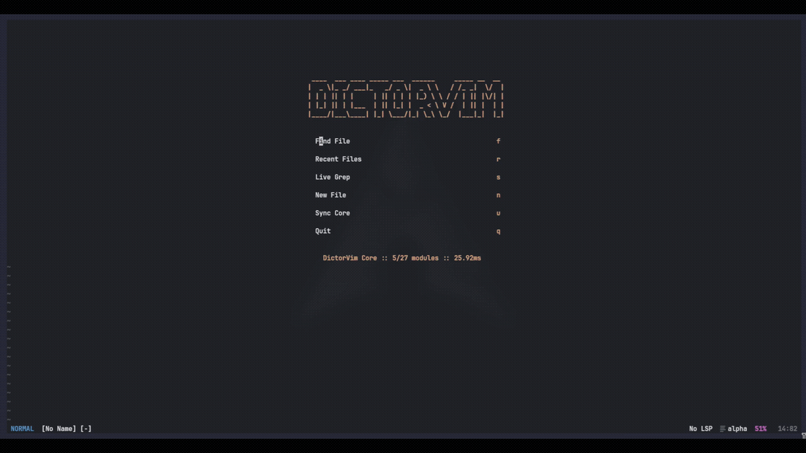

# DictorVim

A high-performance, minimalist Neovim distribution engineered for modern C++, systems programming, and security auditing.

Built directly on the native Neovim 0.12 API without legacy wrapper overhead.

[](https://github.com/Dictor457/DictorVim/actions/workflows/ci.yml)

<p align="center">
  
</p>

---

## Overview

DictorVim is designed specifically for engineers who require an instant, low-latency editing environment with first-class tooling for low-level development. Rather than being a bloated general-purpose bundle, DictorVim excludes unnecessary web-stack layers and focuses strictly on compilation speed, diagnostic accuracy, and memory safety.

### Key Characteristics

- Sub-20ms Boot Time: Zero-cost startup architecture via strict event-driven deferred loading.
- Native Neovim 0.12 Architecture: Full adoption of native `vim.lsp.config`, `vim.lsp.enable`, and built-in Tree-sitter integration.
- Adaptive Build Pipeline: Intelligent detection for multi-file systems projects (CMake, Makefiles) combined with a zero-overhead C++20 runner for single-file algorithms, competitive programming, and exploit PoCs.
- Memory Safety & Hardening: Built-in triggers for AddressSanitizer (`-fsanitize=address,undefined`) to detect buffer overflows and memory corruptions instantly.
- Binary Inspection: Native toggleable hexadecimal editor for ELF files and shellcode analysis.
- Non-Invasive Installation: Runs fully isolated via `NVIM_APPNAME=dictorvim` without modifying your default `~/.config/nvim`.

---

## Visual Preview

### Core Dashboard (<18ms boot)
<p align="center">
  
</p>

### C++ Workflow & Integrated Terminal
<p align="center">
  
</p>

---

## Installation

### Recommended Method (Audited Git Clone)

Inspect and clone the repository directly to maintain full control over your environment:

```bash
git clone https://github.com/Dictor457/DictorVim.git ~/.config/dictorvim
```

Run DictorVim in isolated mode:

```bash
NVIM_APPNAME=dictorvim nvim
```

*(Optional) Configure an alias in your shell configuration (`~/.zshrc` or `~/.bashrc`):*

```bash
alias dvim="NVIM_APPNAME=dictorvim nvim"
```

---

## System Requirements & Toolchain

To utilize the full low-level toolchain, ensure the following packages are present on your system:

- **Editor:** Neovim `>= 0.10.0` (Recommended: `0.12+`)
- **Compilers & Build Systems:** `gcc` / `g++` (C++20 support), `cmake`, `make`
- **LSP & Formatting:** `clang` / `clangd`, `clang-tools-extra`
- **Profiling (Optional):** GNU `time` (`/usr/bin/time`)
- **Terminal:** Linux/Wayland, Nerd Font compatible terminal (e.g., Kitty)

---

## Keybindings Reference

All custom actions use `<Space>` as the leader key.

### C++ Build, Run & Diagnostics

| Binding | Mode | Description |
| :--- | :--- | :--- |
| `<leader>r` | Normal | Smart Build / Run: Auto-detects CMake / Makefile or executes single-file C++20 |
| `<leader>rs` | Normal | Build / Run with AddressSanitizer (`-fsanitize=address,undefined`) |
| `<leader>rf` | Normal | Force execute current single file (bypassing CMake/Make) |
| `<leader>ch` | Normal | Switch between Header and Source implementation via clangd |
| `K` | Normal | Display LSP hover documentation |
| `gd` | Normal | Jump to symbol definition |
| `<leader>rn` | Normal | Symbol rename |
| `<leader>ca` | Normal | Code actions |

### Diagnostics & Tooling

| Binding | Mode | Description |
| :--- | :--- | :--- |
| `<leader>xx` | Normal | Toggle project-wide diagnostics panel (Trouble) |
| `<leader>hx` | Normal | Toggle binary hexadecimal editor |
| `<C-/>` / `<C-_>` | Normal / Term / Insert | Toggle persistent bottom terminal split |

### Navigation & Core

| Binding | Mode | Description |
| :--- | :--- | :--- |
| `<leader>f` | Normal | Find files (Telescope) |
| `<leader>s` | Normal | Live text search across project |
| `<leader>w` | Normal | Write current buffer |
| `<leader>q` | Normal | Close current buffer / window |
| `:Dictor` | Command | Open central dashboard |

---

## License

Open-source under the MIT License. Developed and maintained by [Dictor](https://github.com/dictor457).
